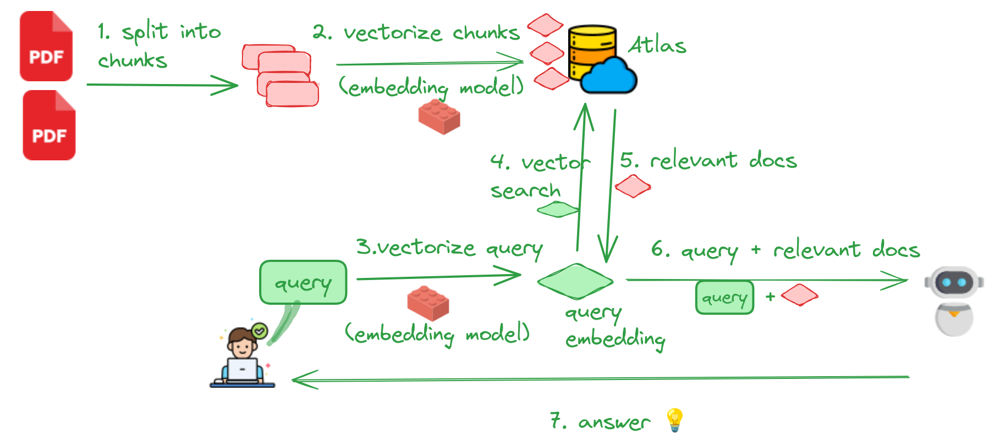

# Readme for Mistral Hackathon (2024-03-23)

## Overview

This workshop will demonstrate how to develop a RAG application of querying PDF documents using:

* MongoDB Atlas as a vector storage
* Mistral as embedding model
* Mistral as LLM

Here is an overview of RAG workflow

See below for handy references

## What do you need to run this workshop?

* A (free) MongoDB Atlas account;  Sign up here : https://www.mongodb.com/cloud/atlas/register
* A Mistral API key; Get it here: https://console.mistral.ai/
* A Jupyter notebook environment.  [Google Colab](https://colab.research.google.com/) (recommended) or a Python dev environment.

## Step-1: Setup Atlas

Follow [this quick start](lab-1-atlas-setup/setup-atlas.md) to setup Atlas.

[Test your connection to Atlas](lab-1-atlas-setup/atlas-test.ipynb)

## Step-2: Process documents and load them to Atlas

Here we will be reading, parsing, indexing PDFs.  

Very importantly we will also calculate **embeddings** for the documents.

And the documents along with embeddings will be stored in Atlas to query later.

These are some of the embedding options:

### A: Mistral AI embedding model

- API based access
- Will need MISTRAL API key
- See notebook [rag-10k-a-populate-embeddings-mistral.ipynb](lab-4-rag/rag-10k-a-populate-embeddings-mistral.ipynb)

### B: Open source embedding models

- Models will run locally
- Medium to large models will benefit from GPU
- See notebook: [rag-10k-a-populate-embeddings-open.ipynb](lab-4-rag/rag-10k-a-populate-embeddings-open.ipynb)

## Step-3: Query Documents with LLM

Now that the documents are in Atlas, let's ask some questions about the documents.

Here we can have a combination of **embedding models** and **LLM**.  See below for some examples

| Embedding model                  | LLM                      | Code                                                                                                         |
|----------------------------------|--------------------------|--------------------------------------------------------------------------------------------------------------|
| Mistral embed (access via API)   | Mistral (access via API) | [rag-10k-b-query-mistral-embeddings-mistral-llm.ipynb](lab-4-rag/rag-10k-b-query-mistral-embeddings-mistral-llm.ipynb) |
| Open source model (runs locally) | Mistral (access via API) | [rag-10k-b-query-open-embeddings-mistral-llm.ipynb](lab-4-rag/rag-10k-b-query-open-embeddings-mistral-llm.ipynb)       |

## Extra: Run local LLM

This [notebook](lab-4-rag/rag-10k-c-query-local-llm.ipynb) demonstrates how to run [Mistral instruct 7b 0.2 model](https://huggingface.co/mistralai/Mistral-7B-Instruct-v0.2) locally

## Extra 2: Try other labs

[Start here](README.md) for other workshops on Atlas vector search, embeddings, RAG and LLMS

## Handy References

### MongoDB Atlas

- Run on cloud, easy, free : https://mongodb.com
- Local
    - [Local setup](https://www.mongodb.com/community/forums/t/introducing-a-local-experience-for-atlas-atlas-search-and-atlas-vector-search-with-the-atlas-cli/246403)
    - [Local with Docker Compose](https://www.mongodb.com/docs/atlas/cli/stable/atlas-cli-deploy-docker/)
- [Atlas vector search forum](https://www.mongodb.com/community/forums/c/atlas/vector-search/168) - for posting questions and getting help

### Tutorials

- [MongoDB Semantic Search Tutorial (Python, Java, Node.js)](https://www.mongodb.com/products/platform/atlas-vector-search)
- [RAG Series Part 1: How to Choose the Right Embedding Model for Your Application](https://www.mongodb.com/developer/products/atlas/choose-embedding-model-rag/)