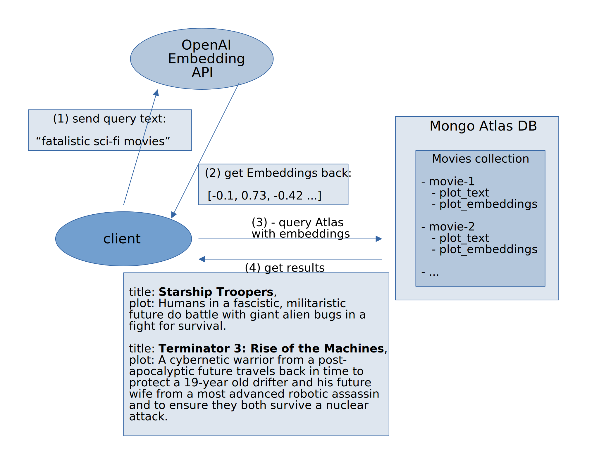
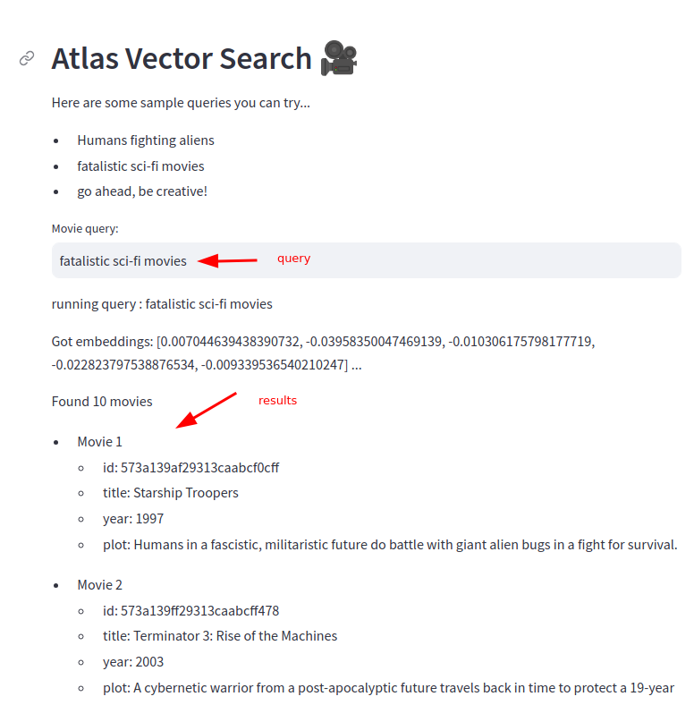

# Vector Search Example Using Mongodb Atlas

## About

**TLDR; How to do vector search using Mongo Atlas?**  Skip to the [fun part below](#the-fun-part) if you are curiuos.

Semantic Search allows us to search by context and meaning instead of simply by keywords.

For example, let's say we are searching movie plots.

- A simple **keyword search** could be searching by **'sci-fi'**
- A **semantic search** could be **'where humans fight aliens'**

For doing semantic search, we need to convert text into  embeddings (vector of numbers).  We also need datastores that can store embeddings or vectors efficiently.  There are many [vector stores](https://aws.amazon.com/what-is/vector-databases/) coming up.  The very popular document datastore [MongoDB](https://www.mongodb.com/) now offers [Mongo Atlas](https://www.mongodb.com/atlas) that supports vector storage and search natively.

This tutorial demonstrates:

- how to setup Mongo Atlas
- how to setup vector embeddings and index them
- and how to query them

You will need:

- Mongo Atlas account (free)
- and OpenAI API Key (paid)

## Architecture



### The Fun Part

We will be querying movie plots using semantic search.  Here is an example.  Notice how the results not mere keyword search, but semantic search.

```text
query : fatalistic sci-fi movies
```

```text
Results: 

1
id: 573a139af29313caabcf0cff
title: Starship Troopers,
year: 1997
plot: Humans in a fascistic, militaristic future do battle with giant alien bugs in a fight for survival.

2
id: 573a139ff29313caabcff478
title: Terminator 3: Rise of the Machines,
year: 2003
plot: A cybernetic warrior from a post-apocalyptic future travels back in time to protect a 19-year old drifter and his future wife from a most advanced robotic assassin and to ensure they both survive a nuclear attack.

3
id: 573a1397f29313caabce61a5
title: Logan's Run,
year: 1976
plot: An idyllic sci-fi future has one major drawback: life must end at 30.

...
```

Pretty cool, eh?

Follow these steps to get this going.

## Step-1: Setup Atlas

Follow [setup-atlas.md](setup-atlas.md)

Also [set up index on Atlas](setup-atlas-index.md)

## Step-2: Setup Python Environment

Follow [setup-python-env.md](setup-python-env.md)

## Step-3: Check OpenAI API Access

Run this notebook: [test-openai.ipynb](test-openai.ipynb) to verify your access key works.

## Step-4: Query Atlas DB

[query-atlas.ipynb](query-atlas.ipynb)

## Step-5: Streamlit UI

You can fireup Streamlit UI like this:

```bash
streamlit  run  streamlit-app.py
```

This will open a browser UI at http://localhost:8501

