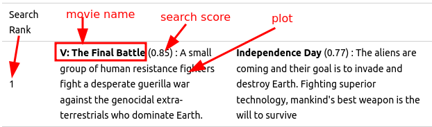

# Comparing Vector Search Results for Different Embedding Models

This is a fun experiment to see how differnet embeddings affect the search results.

MongoDb Atlas is neutral on embeddings.  We can plug in any embedding model.

[streamlit app](lab-2-vector-search-openai/vector-search-streamlit.py)

## Models

Here I have setup two embeddings using two different models

- OpenAI embedding model [more information](https://openai.com/blog/new-and-improved-embedding-model)
- BAAI/bge-small-en-v1.5: This is an open source model. [more information](https://huggingface.co/BAAI/bge-small-en-v1.5)

|                     | OpenAI Embedding Model (text-embedding-ada-002)  | BAAI/bge-small-en-v1.5         |
|---------------------|--------------------------------------------------|--------------------------------|
| Access              | Via API only                                     | Run locally                    |
| Open Source         | No                                               | Yes (MIT)                      |
| Embedding length    | 1536                                             | 384                            |
| Execution time (ms) | 100 - 200 ms (includes network latency)          | 6 ms (on GPU) ,  9 ms (on CPU) |
| Model size          | Unknown                                          | 133 MB                         |
| Model Parameters    | Unknown                                          | 33.5 M                         |

**Update:** On Jan 25, 2024, OpenAI has announced new embedding models: `text-embedding-3-small` and `text-embedding-3-large`.  They are showing good improvements over the `text-embedding-ada-002` model that I have used. [Read more](https://openai.com/blog/new-embedding-models-and-api-updates).  I will update the results with the new models.

## Search Results

And here are the top-5 vector search results, for some queries.

How to interpret the search results.

The search score in bracket (0.85) is a number between 0.0 and 1.0.  Closer to 1.0 is better!   The results are sorted by search score (decreasing order)

You can read the plot lines to see evaulate the search results yourself 😄

### Results for : "humans fighting aliens"

---

|  Search Rank           | OpenAI Embedding (text-embedding-ada-002)                                                                                                                                     | BAAI/bge-small-en-v1.5                                                                                                                                                                                                |
|-------------|-------------------------------------------------------------------------------------------------------------------------------------------------------------------------------|-----------------------------------------------------------------------------------------------------------------------------------------------------------------------------------------------------------------------|
| 1           | **V: The Final Battle** (0.85) :  A small group of human resistance fighters fight a desperate guerilla war against the genocidal extra-terrestrials who dominate Earth.      | **Independence Day** (0.77) :  The aliens are coming and their goal is to invade and destroy Earth. Fighting superior technology, mankind's best weapon is the will to survive                                        |
| 2           | **Falling Skies** (0.85) : Survivors of an alien attack on earth gather together to fight for their lives and fight back.                                                     | **Falling Skies** (0.73) :  Survivors of an alien attack on earth gather together to fight for their lives and fight back.                                                                                            |
| 3           | **Starship Troopers** (0.84) : Humans in a fascistic, militaristic future do battle with giant alien bugs in a fight for survival.                                            | **Starship Troopers** (0.72) :  Humans in a fascistic, militaristic future do battle with giant alien bugs in a fight for survival.                                                                                  |
| 4           | **Battlefield Earth** (0.84) :  After enslavement & near extermination by an alien race in the year 3000, humanity begins to fight back.                                      | **Enemy Mine** (0.68) :  A soldier from Earth crash-lands on an alien world after sustaining battle damage. Eventually he encounters another survivor, but from the enemy species he was fighting; they band together |
| 5           | **Independence Day** (0.81) : The aliens are coming and their goal is to invade and destroy Earth. Fighting superior technology, mankind's best weapon is the will to survive | **V: The Final Battle**  (0.68) :  A small group of human resistance fighters fight a desperate guerilla war against the genocidal extra-terrestrials who dominate Earth.                                             |

---

 We see OpenAI models are scoring higher in the 0.8 range.  Open source model (BAAI/bge-small-en-v1.5) is scoring in 0.6 - 0.7 range.  Not bad!

Overall the Top-5 results are pretty similar.  Which is good to see.

### Results for : "relationship drama between two good friends"

| Search Rank | OpenAI Embedding Model (text-embedding-ada-002)                                                                                                                                     | BAAI/bge-small-en-v1.5                                                                                                                                                              |
|-------------|-------------------------------------------------------------------------------------------------------------------------------------------------------------------------------------|-------------------------------------------------------------------------------------------------------------------------------------------------------------------------------------|
| 1           | **Dark Blue World** (0.80) : The friendship of two men becomes tested when they both fall for the same woman                                                                        | **Varalaaru** (0.65) : Relationships become entangled in an emotional web.                                                                                                          |
| 2           | **Once a Thief** (0.77) : A romantic and action packed story of three best friends, a group of high end art thieves, who come into trouble when a love-triangle forms between them. | **Dark Blue World** (0.64) : The friendship of two men becomes tested when they both fall for the same woman                                                                        |
| 3           | **Hulchul** (0.77) : A man and woman from feuding families each pretend to fall in love, as part of a revenge plot. Chaos ensues when their fake romance becomes a reality.         | **Once a Thief** (0.63) : A romantic and action packed story of three best friends, a group of high end art thieves, who come into trouble when a love-triangle forms between them. |
| 4           | **Styria** (0.77) : Depicts the intense and fractured relationship between a lonely teenager and a beautiful stranger.                                                              | **Arya 2** (0.63) : An unstable and unpredictable male causes havoc for his 'best friend' and lover.                                                                                |
| 5           | **Exiled** (0.76) : A friendship is formed between an ex-gangster, and two groups of hitmen - those who want to protect him and those who were sent to kill him.                    | **Harsh Times** (0.62) - A tough-minded drama about two friends in South Central Los Angeles and the violence that comes between them                                               |

