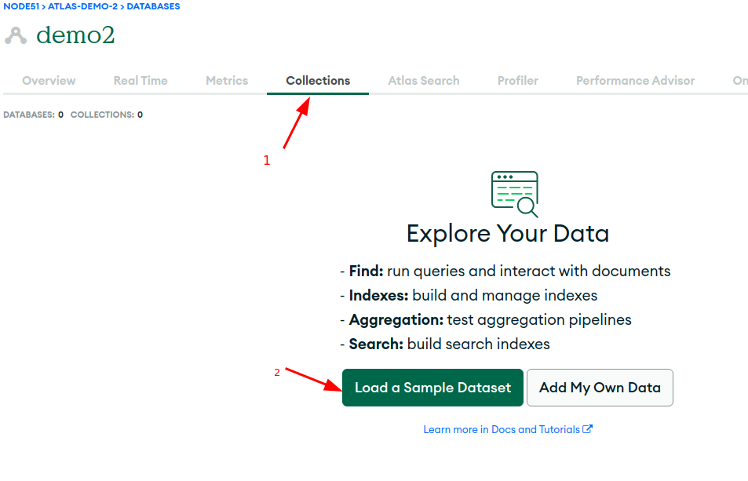
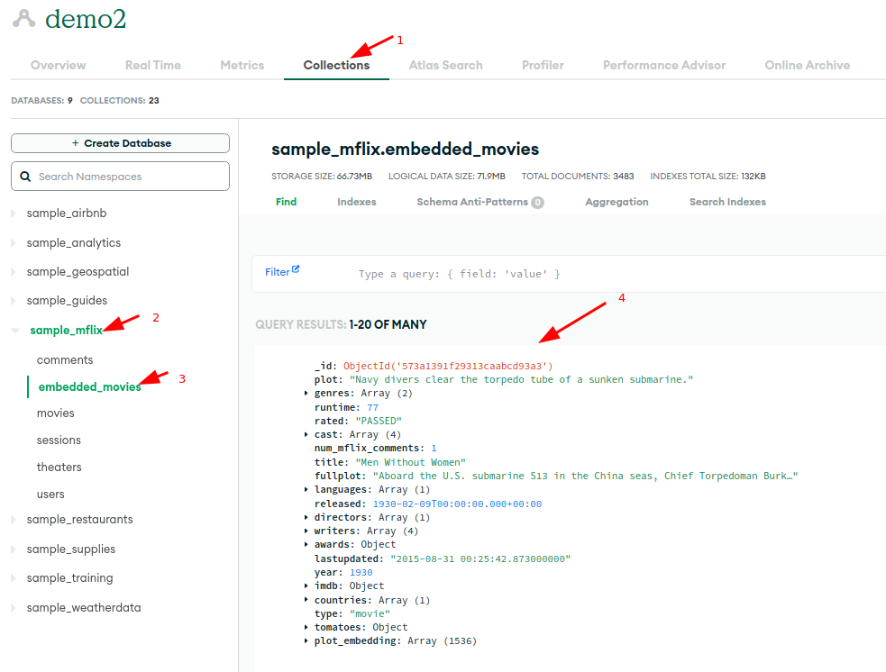
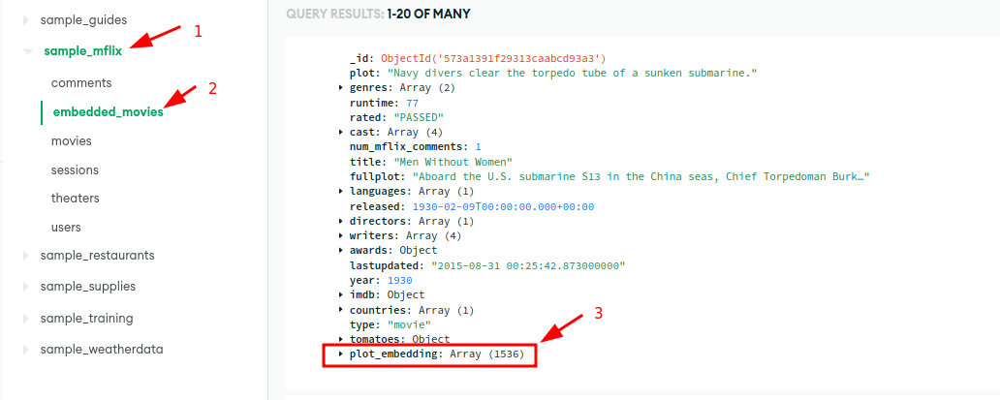
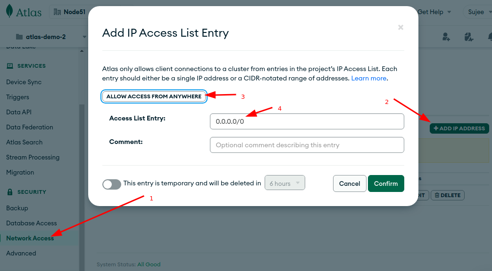

# Setting up Mongo Atlas

## Step-1: Create an Account

Sign up for atlas here : https://www.mongodb.com/atlas

Login to your account

## Step-2: Create a Free Instance

- You can choose any cloud instance
- Choose 'FREE' tier
- Follow the guide.
- Note your username and password to connect to the instance
- For IP access list, add `0.0.0.0/0` .  This makes it available to test from Google Colab. (Note: this makes the instance available from any IP address)

## Step-3: Load Sample Data

This may take a few minutes

## Step-4: View Sample Data

We will use **mflix** data.  This data has movie information.

Use Atlas UI to browse data.

## Step-5: Allow Network Access

For easy access of Atlas from anywhere (from your local machine, Google Colab ..etc), allow network connections from anywhere.

Follow these steps:

- Go to **Network access**
- Select **Add IP Address**
- Choose **Allow access from anywhere**
- See screenshot below

**Note: Doing this opens up Atlas from connections anywhere.  It is not recommended for production setups!**

## Congrats!  Now Atlas is setup  👏