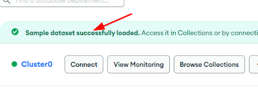
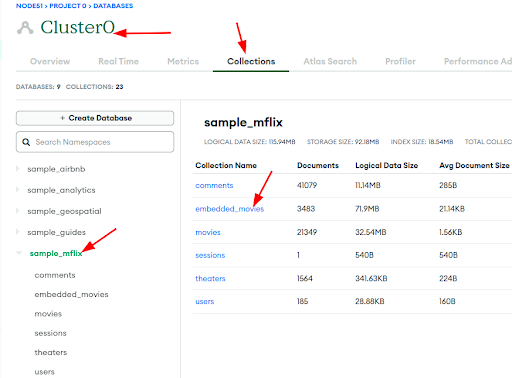
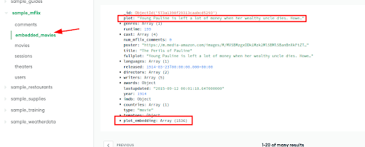

# Setting up Mongo Atlas

## Step-1: Create an Account

Sign up for atlas here : https://www.mongodb.com/atlas

Login to your account

## Step-2: Create a Free Instance

- You can choose any cloud instance
- Choose 'FREE' tier
- Follow the guide.
- Note your username and password to connect to the instance
- Also **add your public-ip to acces list**.  This is necessary to accesss the cluster

## Step-3: Load Sample Data

This may take a few minutes

## Step-4: View Sample Data

We will use **mflix** data.  This data has movie information.

You can browse a few movies here.

## Step-5: Inspect Embeddings

This data already has vector embeddings for plots.  Embeddings are numbers or vectors.

Inspect embedding data

## Congrats!  Now Atlas dB is setup  👏