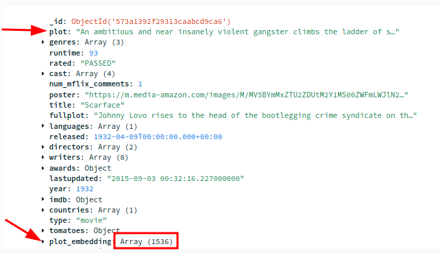

# Lab-2 - Vector Search Using OpenAI Embeddings

**In this lab, we will do the following:**

- ✅ The `embedded_movies` collection is already loaded into Atlas
- ✅ The collection already has an embedding attribute populated using OpenAI embeddings
- 👉 We will encode our query using OpenAI API call, and send the query to Atlas.  And get results back

## Movie Data




## Data Flow


## Lab 2.1 - Setup Atlas Index

[set up index on Atlas](setup-atlas-index.md)

## Lab 2.2 - Check OpenAI API Access

You will need an OpenAI API key.

You can get one [here](https://platform.openai.com/account/api-keys)

Run this notebook: [openai-test.ipynb](openai-test.ipynb) to verify your access key works.

## Lab 2.3 - Query Atlas DB

We have every thing we need to query Atlas!

[vector-search-openai.ipynb](vector-search-openai.ipynb)

## Lab 2.4 - Streamlit UI

Let's do a simple UI to display our movie results!

You can fireup Streamlit UI like this:

```bash
streamlit  run  vector-search-streamlit.py
```

This will open a browser UI at http://localhost:8501


## Sample Search Results

Query : **Fatalistic sci-fi movies**

Results:

```text
title: V: The Final Battle,
year: 1984
search_score(meta):0.80
plot: A small group of human resistance fighters fight a desperate guerilla war against the genocidal extra-terrestrials who dominate Earth.

title: Pixels,
year: 2015
search_score(meta):0.79
plot: When aliens misinterpret video feeds of classic arcade games as a declaration of war, they attack the Earth in the form of the video games.

title: Battlefield Earth,
year: 2000
search_score(meta):0.79
plot: After enslavement & near extermination by an alien race in the year 3000, humanity begins to fight back.

title: Falling Skies,
year: 2011è
search_score(meta):0.78
plot: Survivors of an alien attack on earth gather together to fight for their lives and fight back.

title: Battlestar Galactica,
year: 2003
search_score(meta):0.78
plot: A re-imagining of the original series in which a "rag-tag fugitive fleet" of the last remnants of mankind flees pursuing robots while simultaneously searching for their true home, Earth.
```