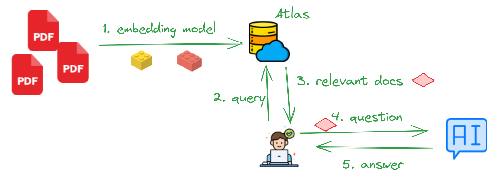

# Lab-4: RAG (Retrival Augmented Generation) with DB Atlas

In this lab, we will do the following:

- 👉 Load PDF documents
- 👉 Use embedding models to calculate embeddings for PDF documents
- 👉 Upload them into Atlas
- 👉 Then query these PDF documents using LLMs

## Architecture and Dataflow

And here is the result of sample query

## Lab 4.1 - Calculate Embeddings for the documents

First step is reading, parsing, indexing PDFs.  

Very importantly we will also calculate embeddings for the documents.

And the documents along with embeddings will be uploaded into Atlas to query later.

These are some of the embedding options:

| Embedding model | Embedding size       | details                                | Code                                                                                                 |
|-----------------|----------------------|----------------------------------------|------------------------------------------------------------------------------------------------------|
| OpenAI          | varies               | API access (will need OPENAI API KEY)  | TODO                                                                                                 |
| Mistral         | 1024                 | API access (will need MISTRAL API KEY) | [rag-10k-a-populate-embeddings-mistral.ipynb](rag-10k-a-populate-embeddings-mistral.ipynb) |
| Open (various)  | varies (384 to 1024) | Runs locally                           | [rag-10k-a-populate-embeddings-open.ipynb](rag-10k-a-populate-embeddings-open.ipynb)       |

## Lab 4.2 - Query documents using LLM

Now that the documents are in Atlas, let's ask some questions about the documents.

Here we can have a combination of **embedding models** and **LLM**.  See below for some examples

| Embedding model                  | LLM                      | Code                                                                                                         |
|----------------------------------|--------------------------|--------------------------------------------------------------------------------------------------------------|
| OpenAI embed (access via API)    | OpenAI (access via API)  | TODO                                                                                                         |
| Open source model (runs locally) | OpenAI (access via API)  | [rag-10k-b-query-open-embeddings-openAI-llm.ipynb](rag-10k-b-query-open-embeddings-openAI-llm.ipynb)         |
|                                  |                          |                                                                                                              |
| Mistral embed (access via API)   | Mistral (access via API) | [rag-10k-b-query-mistral-embeddings-mistral-llm.ipynb](rag-10k-b-query-mistral-embeddings-mistral-llm.ipynb) |
| Open source model (runs locally) | Mistral (access via API) | [rag-10k-b-query-open-embeddings-mistral-llm.ipynb](rag-10k-b-query-open-embeddings-mistral-llm.ipynb)       |

## Lab 4.3 - Test run a local LLM

Running this notebook to see how well you can run an LLM 

Using llama-cpp API: [test-local-llm-llama-cpp.ipynb](test-local-llm-llama-cpp.ipynb)

Using llama-index API: [test-local-llm-llama-index.ipynb](test-local-llm-llama-index.ipynb)

## Lab 4.4 - Query documents using local LLMs

Let's query documents, this time using a LLM (Large Language Model) running locally on our laptop!

This notebook demonstrates how to run [Mistral instruct 7b 0.2 model](https://huggingface.co/mistralai/Mistral-7B-Instruct-v0.2) locally

| Embedding model                  | LLM                                    | Code                                                                         |
|----------------------------------|----------------------------------------|------------------------------------------------------------------------------|
| Open source model (runs locally) | Mistral-Instruct-7B-v02 (runs locally) | [rag-10k-c-query-local-llm-mistral-instruct-1.ipynb](rag-10k-c-query-local-llm-mistral-instruct-1.ipynb) |

### Benchmark: CPU vs. GPU

| LLM           | Mistral API          | Mistral 7B on GPU                                                                         | Mistral 7B on CPU                                                                                  |
|---------------|----------------------|-------------------------------------------------------------------------------------------|----------------------------------------------------------------------------------------------------|
| Response time | 2 - 7 seconds        | 2 - 5 secs                                                                                | 90 - 150 secs                                                                                      |
| Model         | Mistral-large-latest | mistral-7b-instruct-v0.2.Q4_K_M.gguf                                                      | mistral-7b-instruct-v0.2.Q4_K_M.gguf                                                               |
| Performance   |                      | ~ 50 tokens / sec                                                                         | ~ 5 tokens / sec                                                                                   |
| Hardware      |                      | - Ubuntu Linux 22.04 - 16 core CPU  - 32 G Memory  - Nvidia 2070 with 8GB memory | - Ubuntu Linux 22.04 - 16 core CPU - 32 G Memory - Nvidia 2070 with 8GB memory (disabled) |