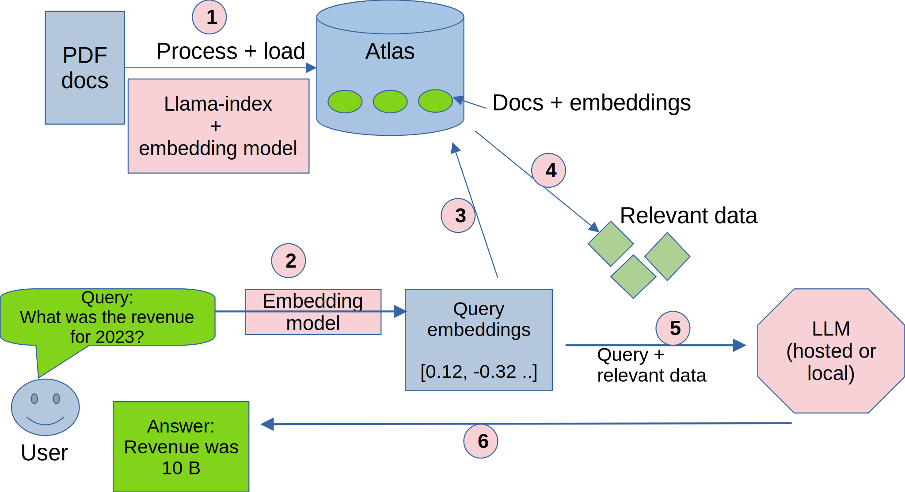

# Lab-4: RAG (Retrival Augmented Generation) with DB Atlas

In this lab, we will do the following:

- 👉 Load PDF documents
- 👉 Use embedding models to calculate embeddings for PDF documents
👉 Upload them into Atlas
- 👉 Then query these PDF documents

## Architecture and Dataflow

## Lab 4.1 - Upload PDFs into Atlas

First step is reading, parsing, indexing PDFs.  And we will upload the documents into Atlas to query later.

Follow this notebook: [rag-10k-a-populate.ipynb](rag-10k-a-populate.ipynb)

## Lab 4.2 - Query documents using OpenAI LLM (ChatGPT)

Now that the documents are in Atlas, let's ask some questions about the documents.  Our LLM here will be OpenAI Chat GPT

Follow [rag-10k-b-query-openAI.ipynb](rag-10k-b-query-openAI.ipynb)

## Lab 4.3 - Test run a local LLM

Running this notebook to see how well you can run an LLM 

[test-local-llm.ipynb](test-local-llm.ipynb)

## Lab 4.4 - Query documents using local LLMs

Let's query documents, this time using a LLM (Large Language Model) running locally on our laptop!

Follow [rag-10k-c-query-local-llm.ipynb](rag-10k-c-query-local-llm.ipynb)