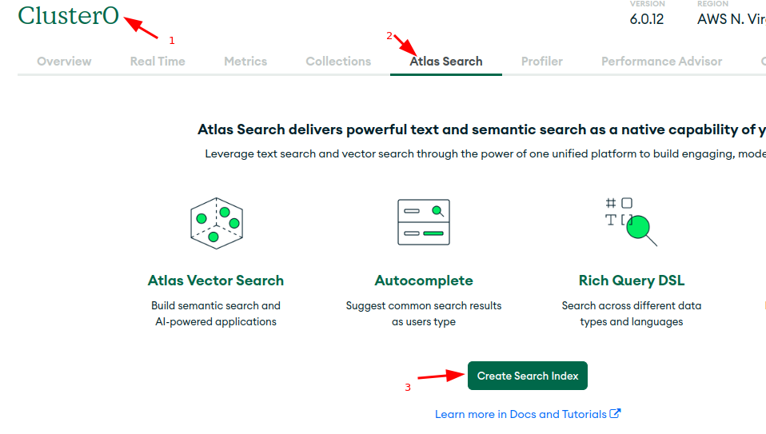
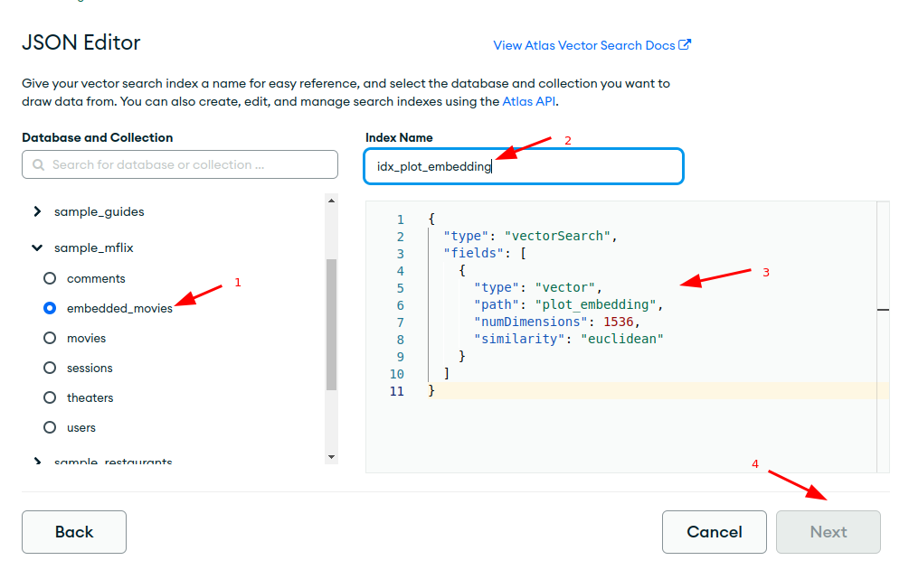
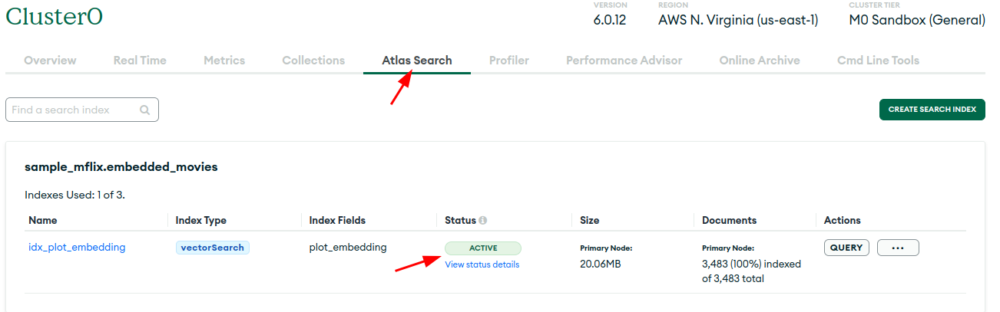

# Setting up Atlas Index

We need to setup an index, before we can perform a vector search

## References

- https://www.mongodb.com/docs/atlas/atlas-vector-search/vector-search-tutorial/#create-the-atlas-vector-search-index

Index name: `idx_plot_embedding`

- Option-1 (preferred): Use Atlas UI
- Option-2: Use the python code

## Option-1 (preferred): Use the Following JSON snippet in Atlas UI

```json
{
  "type": "vectorSearch",
  "fields": [
    {
      "type": "vector",
      "path": "plot_embedding",
      "numDimensions": 1536,
      "similarity": "euclidean"
    }
  ]
}
```

Use these screenshots are guidelines.

**Wait till the index is ready to be used**








## Option-2: Using Code

You can execute the following code to create index programatically 

```python
INDEX_NAME = 'idx_plot_embedding'

## TODO: fix this

# collection.create_search_index(
#     {"definition":
#         {"mappings": {"dynamic": True, "fields": {
#             'plot_embedding' : {
#                 "dimensions": 1536,
#                 "similarity": "dotProduct",
#                 "type": "knnVector"
#                 }}}},
#      "name": INDEX_NAME
#     }
# )
```